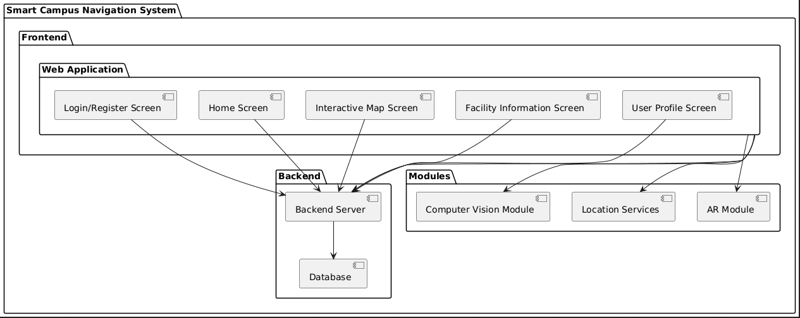

# Smart Campus Navigation System

A web application (Prototype of) developed for the University of Cape Coast to help new students and visitors navigate the campus efficiently using real-time guidance and information about campus facilities.
Prototype of the Smart Campus Navigation System using Flask for the backend and HTML & CSS for the frontend. This prototype includes a # login page, a home page with an interactive map, and a facility information page.

## Table of Contents

- [Project Description](#project-description)
- [Features](#features)
- [Technology Stack](#technology-stack)
- [Installation](#installation)
- [Usage](#usage)
- [Project Workflow](#project-workflow)
- [License](#license)
- [Contributing](#contributing)
- [Contact](#contact)

## Project Description

The Smart Campus Navigation System leverages computer vision and location-based services to assist users in navigating the University of Cape Coast campus. The application provides real-time navigation, detailed facility information, and a user-friendly interface.


# Project Structure
## Smart_campus_navigation/
#### |__ myvenv  virtual environment
#### ├── app.py   main application
#### ├── static/  Contains the static files, eg css, javascript
##### │   └── styles.css
##### ├── templates/       contains the html files
##### │   ├── base.html
##### │   ├── home.html
##### │   ├── login.html
##### │   └── facility.html   
##### └── requirements.txt   Contains the installations needed to run this application
##### |__ Readme.md          This is the readme file

## Features

- **Interactive Campus Map:** Explore the UCC campus with an interactive map.
- **Real-Time Navigation:** Get turn-by-turn directions for both outdoor and indoor navigation.
- **Facility Information:** Access detailed information about campus facilities.
- **Search and Filter:** Search for specific locations or facilities with filters.
- **Notifications and Alerts:** Receive notifications about important events and navigation alerts.
- **Personalization:** Customize the app based on user preferences.

## Technology Stack

### Frontend
- HTML
- CSS
- JavaScript

### Backend
- Flask (Python)
- SQLite (Database)

### Additional Tools and Libraries
- Google Maps API (for map integration)
- OpenCV (for computer vision)
- Firebase (for real-time database and authentication)

## Installation

### Prerequisites
- Python 3.x
- Flask
- SQLite

### Steps

1. Clone the repository:
    ```bash
    git clone https://github.com/AyambaSumaila/smart-campus-navigation.git
    ```
2. Change to the project directory:
    ```bash
    cd smart-campus-navigation
    ```
3. Install the required packages:
    ```bash
    pip install -r requirements.txt
    ```
4. Set up the database:
    ```bash
    flask db init
    flask db migrate
    flask db upgrade
    ```
5. Run the application:
    ```bash
    flask run
    ```

## Project Screen shots 

##  UML diagram of the project


### Home Page of the Application


### Map for uses to search for locations on campus


### Login Page Page of the Application


## Usage

1. Navigate to `http://127.0.0.1:5000/` in your web browser.
2. Use the interactive map to explore the campus.
3. Search for facilities and get real-time navigation assistance.
4. Receive notifications and alerts about campus events and navigation issues.

## Project Workflow

1. **Requirement Analysis:**
    - Identify user needs and system requirements.
    - Gather UCC campus maps and facility information.

2. **Design:**
    - Design the user interface (wireframes, mockups).
    - Design the system architecture (components, data flow).
    - Plan the database schema.

3. **Implementation:**
    - Develop the frontend application using HTML, CSS, and JavaScript.
    - Set up the backend server with Flask and SQLite.
    - Implement computer vision functionalities with OpenCV.
    - Integrate AR capabilities and location services.

4. **Testing:**
    - Perform unit testing for individual components.
    - Conduct integration testing for the entire system.
    - Perform user acceptance testing (UAT) with a group of new students and visitors.

5. **Deployment:**
    - Deploy the backend server on a cloud platform (e.g., AWS, Heroku).
    - Ensure the web application is accessible from any web browser.

6. **Maintenance and Updates:**
    - Monitor system performance and user feedback.
    - Fix bugs and update the system as needed.
    - Add new features based on user feedback and technological advancements.

## License

This project is licensed under the MIT License. See the [LICENSE](LICENSE) file for details.

## Contributing

We welcome contributions from the community. Please see our [CONTRIBUTING](CONTRIBUTING.md) guidelines for more details.


